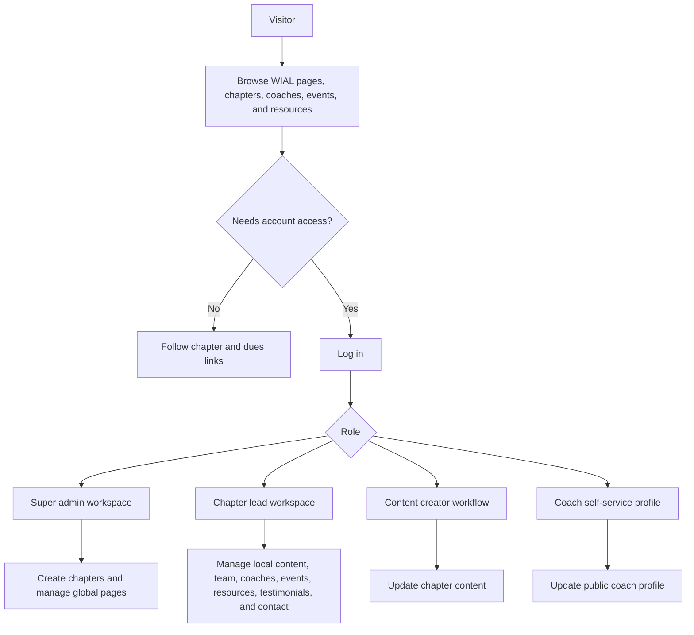
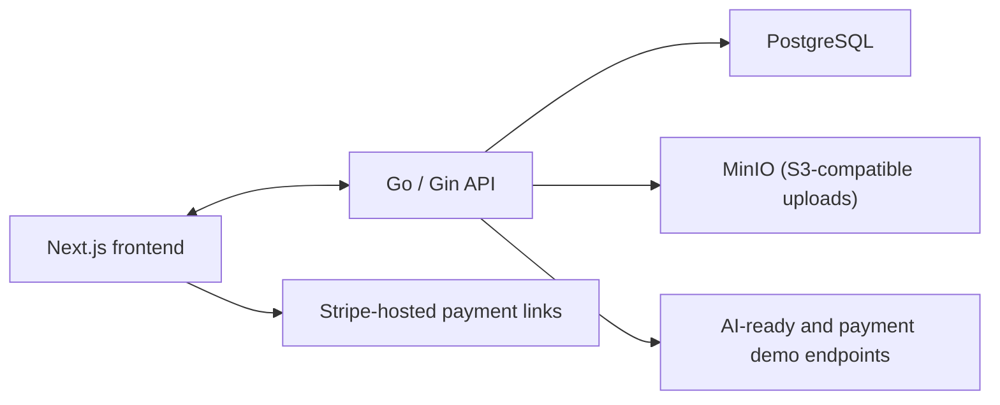

# 2026_spring_wics_asu Hackathon Project

## Quick Links
- [Hackathon Details](https://www.ohack.dev/hack/2026_spring_wics_asu)
- [DevPost Submission](https://wics-ohack-sp26-hackathon.devpost.com/)
- [Team Slack Channel](https://opportunity-hack.slack.com/app_redirect?channel=team-28-shawarmaalgo)
- [Product Brief](./project_description.md)
- [Frontend Documentation](./frontend/README.md)
- [Backend Documentation](./backend/README.md)
- [Frontend-to-Backend Handoff](./frontend/docs/BACKEND_HANDOFF.md)
- [OpenAPI Spec](./backend/api/openapi.yaml)
- [Fixes Applied](./FIXES_APPLIED.md)

## Team "shawarmaalgo"
- Humza Faisal
- Beybut Abdulrahimov
- Ayan Islam

## Project Overview
`shawarmaalgo` is a full-stack platform for the World Institute for Action Learning (WIAL). The goal is to replace fragmented chapter workflows with one shared system for public discovery, chapter publishing, coach management, and role-based administration.

### What We Built
- A public WIAL site and country-level chapter pages in Next.js
- A searchable global coach directory with chapter, certification, language, and specialization filters
- Admin and chapter portals for managing chapter content, team members, coaches, events, resources, testimonials, and contact information
- A Go API with PostgreSQL persistence, S3-compatible image uploads, and OpenAPI documentation
- AI-ready coach search and chapter generation demo endpoints
- Stripe-linked dues flows plus a simulated checkout-session endpoint for payment integration scaffolding

### Why It Matters
- WIAL chapters need consistent branding without losing local ownership
- Coaches need a discoverable, filterable directory instead of scattered chapter records
- Chapter leaders need simple tools to publish updates without engineering support
- Global admins need visibility into chapters, users, and content across the network

### User Flow


### System Architecture


The current hackathon build includes real content management, uploads, and CRUD flows. The AI chapter-generation flow and checkout-session API are still demo-oriented scaffolding rather than production integrations.

## Tech Stack
- Frontend: [Next.js 14](https://nextjs.org/), [React 18](https://react.dev/), [TypeScript](https://www.typescriptlang.org/), [Tailwind CSS](https://tailwindcss.com/)
- Backend: [Go](https://go.dev/), [Gin](https://gin-gonic.com/), [pgx](https://github.com/jackc/pgx)
- Data and storage: [PostgreSQL](https://www.postgresql.org/), [MinIO](https://min.io/)
- API docs: [OpenAPI 3.0](https://spec.openapis.org/oas/latest.html), Swagger UI
- Tooling: [Docker Compose](https://docs.docker.com/compose/), npm, Go modules

### Repository Map
- [`frontend/`](./frontend) contains the Next.js app, route handlers, shared UI, and API client helpers
- [`backend/`](./backend) contains the Go API, handlers, router, storage integration, and SQL migrations
- [`frontend/docs/BACKEND_HANDOFF.md`](./frontend/docs/BACKEND_HANDOFF.md) maps frontend data needs to backend routes
- [`project_description.md`](./project_description.md) captures the product brief and stakeholder context
- [`FIXES_APPLIED.md`](./FIXES_APPLIED.md) summarizes notable implementation fixes already completed

## Getting Started
### Prerequisites
- [Node.js 20+](https://nodejs.org/)
- [Go 1.25+](https://go.dev/doc/install)
- [Docker](https://www.docker.com/) and Docker Compose for containerized setup
- A local PostgreSQL-compatible database and S3-compatible object store if you run services outside Docker

### Option 1: Docker Compose Demo Stack
Review [`docker-compose.yml`](./docker-compose.yml) and [`.env.example`](./.env.example) so the service configuration matches your environment, then run:

```bash
git clone https://github.com/2026-ASU-WiCS-Opportunity-Hack/28-shawarmaalgo.git
cd 28-shawarmaalgo
docker compose up --build
```

Expected local endpoints:

| Service | URL |
| --- | --- |
| Frontend | `http://localhost:3000` |
| Backend API | `http://localhost:8080/api/v1` |
| Swagger UI | `http://localhost:8080/swagger-ui` |
| PostgreSQL | `localhost:5432` |
| MinIO API | `http://localhost:9000` |
| MinIO Console | `http://localhost:9001` |

### Option 2: Run Frontend and Backend Separately
1. Copy values from [`.env.example`](./.env.example) into `backend/.env`.
2. Copy the frontend values into `frontend/.env.local`.
3. Start PostgreSQL and MinIO.
4. Start the backend:

```bash
cd backend
go run ./cmd/server
```

5. Start the frontend in a second terminal:

```bash
cd frontend
npm install
npm run dev
```

When the `users` table is empty, the backend uses `SUPER_ADMIN_EMAIL` and `SUPER_ADMIN_PASSWORD` to bootstrap the first super admin.

## Documentation and API Links
- Start with the [Frontend Documentation](./frontend/README.md) for routes, rendering, and API usage
- Use the [Backend Documentation](./backend/README.md) for environment setup, roles, and endpoint ownership
- Use the [Frontend-to-Backend Handoff](./frontend/docs/BACKEND_HANDOFF.md) for the current integration contract
- Review the [OpenAPI Spec](./backend/api/openapi.yaml) or open Swagger UI at [`/swagger-ui`](http://localhost:8080/swagger-ui) when the backend is running

## Checklist for the final submission
### 0/Judging Criteria
- [ ] Review the [judging criteria](https://www.ohack.dev/about/judges#judging-criteria)

### 1/DevPost
- [ ] Submit a [DevPost project](https://wics-ohack-sp26-hackathon.devpost.com/)
- [ ] Keep the demo video to 4 minutes or less
- [ ] Link your team on [ohack.dev](https://www.ohack.dev/hack/2026_spring_wics_asu/manageteam)
- [ ] Link your GitHub repo on DevPost under "Try it out"

### 2/GitHub
- [ ] Add everyone on your team to your GitHub repo
- [ ] Make sure your repo is public
- [x] Make sure your repo has a MIT License
- [x] Make sure your repo has a detailed README.md
