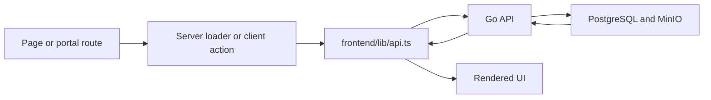

# WIAL Frontend

The frontend is a Next.js App Router application for WIAL public pages, chapter microsites, and role-based management portals.

## Links
- [Project README](../README.md)
- [Backend Documentation](../backend/README.md)
- [Frontend-to-Backend Handoff](./docs/BACKEND_HANDOFF.md)
- [OpenAPI Spec](../backend/api/openapi.yaml)

## What the Frontend Includes
- Public marketing pages for WIAL content and certification information
- Country-level chapter pages under `/:country`
- A global coach directory with client-facing filters
- Admin screens for chapter provisioning, global page editing, and managed users
- Chapter workspaces for content, team members, coaches, events, resources, testimonials, and contact details
- Coach self-service profile management

## Frontend Data Flow


## Stack
- [Next.js App Router](https://nextjs.org/docs/app)
- [React 18](https://react.dev/)
- [TypeScript](https://www.typescriptlang.org/)
- [Tailwind CSS](https://tailwindcss.com/)

## Routes
### Public routes
- `/`
- `/about`
- `/action-learning`
- `/certification`
- `/chapters`
- `/coaches`
- `/events`
- `/resources`
- `/contact`
- `/countries`

### Country routes
- `/:country`
- `/:country/about`
- `/:country/team`
- `/:country/coaches`
- `/:country/events`
- `/:country/resources`
- `/:country/contact`

### Portal routes
- `/login`
- `/portal`
- `/portal/admin`
- `/portal/admin/chapters`
- `/portal/admin/chapters/new`
- `/portal/admin/chapters/[slug]`
- `/portal/admin/pages`
- `/portal/admin/users`
- `/portal/chapter`
- `/portal/chapter/[country]/content`
- `/portal/chapter/[country]/team`
- `/portal/chapter/[country]/coaches`
- `/portal/chapter/[country]/events`
- `/portal/chapter/[country]/resources`
- `/portal/chapter/[country]/testimonials`
- `/portal/chapter/[country]/contact`
- `/portal/coach`

## Environment
Create `frontend/.env.local` from [`../.env.example`](../.env.example) or [`./.env.example`](./.env.example):

```bash
NEXT_PUBLIC_API_BASE_URL=http://localhost:8080/api/v1
```

If the frontend is running in Docker while the backend runs in another container, also set `INTERNAL_API_BASE_URL` in the runtime environment so server components can reach the API on the container network.

## Run
```bash
cd frontend
npm install
npm run dev
```

Open [`http://localhost:3000`](http://localhost:3000).

## Integration Map
The frontend client in [`./lib/api.ts`](./lib/api.ts) is aligned to the current backend router, not the older `/api/portal/chapters/:slug/...` contract.

### Auth and current user
- `POST /api/v1/auth/login`
- `GET /api/v1/me`
- `PATCH /api/v1/me/coach`

### Public data
- `GET /api/v1/chapters`
- `GET /api/v1/chapters/:id`
- `GET /api/v1/coaches`
- `GET /api/v1/coaches/:id`
- `GET /api/v1/events`
- `GET /api/v1/team-members`
- `GET /api/v1/resources`
- `GET /api/v1/testimonials`
- `GET /api/v1/global-pages`
- `GET /api/v1/global-pages/:slug`

### Portal summary data
- `GET /api/v1/portal/overview`
- `GET /api/v1/portal/chapter`

### Managed CRUD used by portal screens
- `POST|GET|PATCH|DELETE /api/v1/users`
- `POST|GET|PUT|PATCH|DELETE /api/v1/chapters`
- `POST|GET|PATCH|DELETE /api/v1/coaches`
- `POST|GET|PATCH|DELETE /api/v1/events`
- `POST|GET|PATCH|DELETE /api/v1/team-members`
- `POST|GET|PATCH|DELETE /api/v1/resources`
- `POST|GET|PATCH|DELETE /api/v1/testimonials`
- `PATCH /api/v1/global-pages/:slug`
- `POST /api/v1/uploads/images`

### Demo and exploration endpoints
- `GET /api/v1/ai/coach-search`
- `POST /api/v1/ai/generate-chapter`
- `POST /api/v1/payments/create-session`

## Rendering Notes
- Public pages are primarily server-rendered and can stay cache-friendly
- Portal routes are intentionally dynamic because they depend on auth and recent data
- The app already supports server-side API access through `INTERNAL_API_BASE_URL`
- Several public pages fall back to local seed data when backend data is missing, which is useful for demos

## Payment and AI Notes
- Resource pages include Stripe-hosted dues links for the demo experience
- The backend checkout-session endpoint is still simulated
- The AI search and chapter-generation endpoints are integration stubs, not a finished production AI stack
