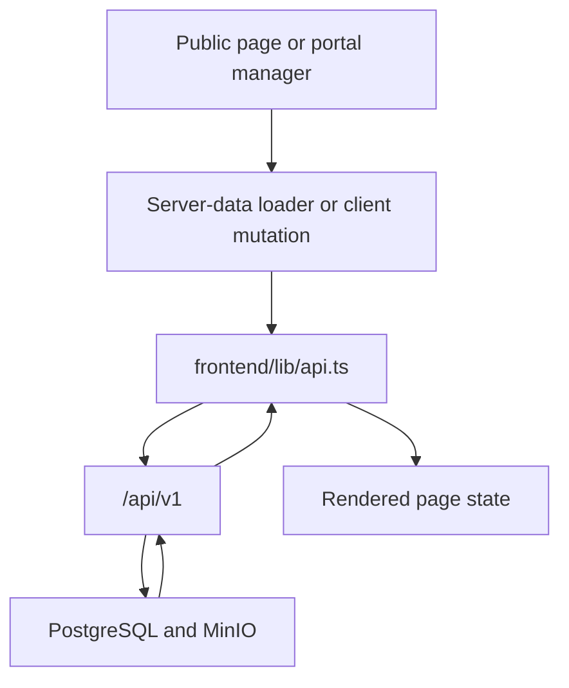

# Frontend-to-Backend Handoff

This document maps the current frontend data needs to the backend routes that actually exist today.

## Links
- [Project README](../../README.md)
- [Frontend Documentation](../README.md)
- [Backend Documentation](../../backend/README.md)
- [OpenAPI Spec](../../backend/api/openapi.yaml)

## Integration Flow

## Important Contract Update
Older docs described routes like `/api/portal/chapters/:slug/...`. That is not the current backend contract.

The current implementation uses:
- generic resource CRUD endpoints under `/api/v1`
- chapter scoping enforced by auth and role checks
- chapter IDs for most mutations
- `GET /api/v1/portal/overview` and `GET /api/v1/portal/chapter` for portal summary data

## Priority Integration Order
1. Authentication and current-user loading
2. Public chapter and coach discovery
3. Portal overview and chapter context
4. CRUD for team members, coaches, events, resources, testimonials, and chapter content
5. Global page editing and image uploads
6. AI and payments demo endpoints

## Endpoint Matrix
### Auth and current user
- `POST /api/v1/auth/login`
- `GET /api/v1/me`
- `PATCH /api/v1/me/coach`

Frontend usage:
- login page
- portal bootstrapping
- coach self-service editing

### Portal summary
- `GET /api/v1/portal/overview`
- `GET /api/v1/portal/chapter`

Frontend usage:
- `/portal/admin`
- `/portal/chapter`
- chapter-aware redirects and workspace headers

### Chapters
- `GET /api/v1/chapters`
- `GET /api/v1/chapters/:id`
- `POST /api/v1/chapters`
- `PUT /api/v1/chapters/:id`
- `PATCH /api/v1/chapters/:id`
- `PATCH /api/v1/chapters/:id/content`
- `DELETE /api/v1/chapters/:id`

Frontend usage:
- public chapter discovery
- admin chapter creation and editing
- chapter content management

### Coaches
- `GET /api/v1/coaches`
- `GET /api/v1/coaches/:id`
- `POST /api/v1/coaches`
- `PATCH /api/v1/coaches/:id`
- `DELETE /api/v1/coaches/:id`

Frontend usage:
- global coach directory
- chapter coach management
- coach portal profile updates

### Events
- `GET /api/v1/events`
- `POST /api/v1/events`
- `PATCH /api/v1/events/:id`
- `DELETE /api/v1/events/:id`

Frontend usage:
- global events pages
- chapter event management

### Team members
- `GET /api/v1/team-members`
- `GET /api/v1/team-members/:id`
- `POST /api/v1/team-members`
- `PATCH /api/v1/team-members/:id`
- `DELETE /api/v1/team-members/:id`

Frontend usage:
- country team pages
- chapter team management

### Resources
- `GET /api/v1/resources`
- `GET /api/v1/resources/:id`
- `POST /api/v1/resources`
- `PATCH /api/v1/resources/:id`
- `DELETE /api/v1/resources/:id`

Frontend usage:
- public resources pages
- chapter resource management

### Testimonials
- `GET /api/v1/testimonials`
- `GET /api/v1/testimonials/:id`
- `POST /api/v1/testimonials`
- `PATCH /api/v1/testimonials/:id`
- `DELETE /api/v1/testimonials/:id`

Frontend usage:
- chapter landing-page testimonial sections
- chapter testimonial management

### Global pages and uploads
- `GET /api/v1/global-pages`
- `GET /api/v1/global-pages/:slug`
- `PATCH /api/v1/global-pages/:slug`
- `POST /api/v1/uploads/images`

Frontend usage:
- editable marketing pages
- image uploads from admin and chapter tools

### Managed users
- `GET /api/v1/users`
- `POST /api/v1/users`
- `GET /api/v1/users/:id`
- `PATCH /api/v1/users/:id`
- `DELETE /api/v1/users/:id`

Frontend usage:
- admin user management
- chapter lead user provisioning

### Demo endpoints
- `GET /api/v1/ai/coach-search`
- `POST /api/v1/ai/generate-chapter`
- `POST /api/v1/payments/create-session`

Frontend usage:
- optional hackathon demos and future integration points

## Notes for Backend Teammates
- Public country pages are composed from multiple API calls, not one monolithic chapter payload
- The frontend often resolves a chapter first, then uses `chapter.id` for related team, coach, event, resource, and testimonial queries
- `frontend/lib/api.ts` is the source of truth for current request shapes on the frontend side
- Swagger and the OpenAPI file should stay in sync with `backend/internal/router/router.go`
